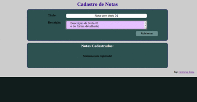

# Atividade Prática

* **Demonstrado:**

Para encerrar a primeira metade do módulo 1 - Fundamentos, foi pedido demonstrado como fazer um **CRUD**(Create, Read, Update, Delete) na forma de site que recebe inputs de nomes e os adiciona em uma lista na tela. Além disto, foram adicionadas as funcionalidades de remoção e e edição dos nomes. 

* **Feito:**

Resolvi alterar um pouco o que foi mostrado, onde foi feito uma aplicação semelhante, porém nesta guardam-se notas com titulo e descrição. Além disto, tentei resolvi treinar o Style(CSS) a fim de deixar a aplicação mais interessante.